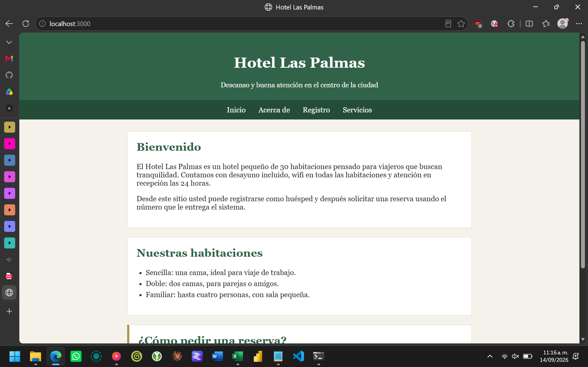
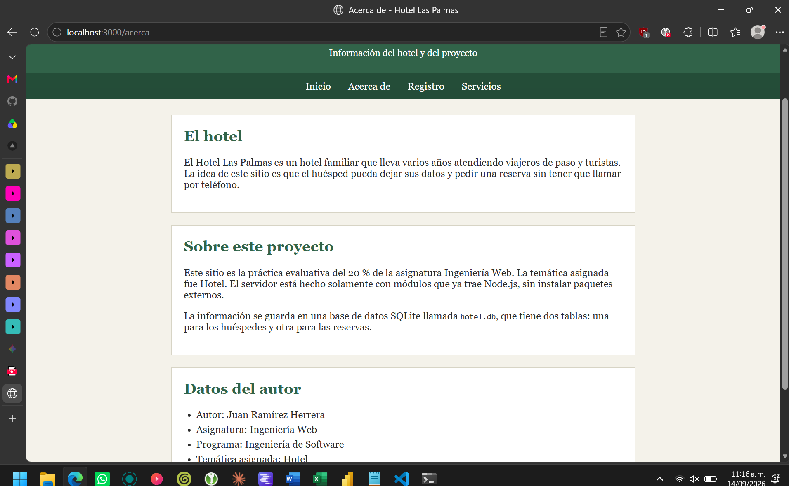
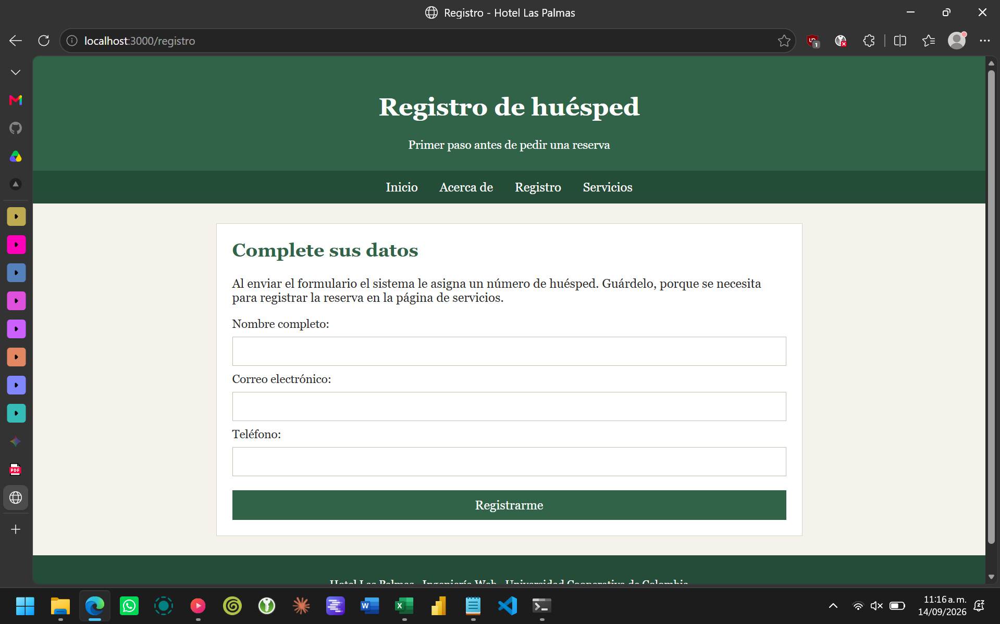
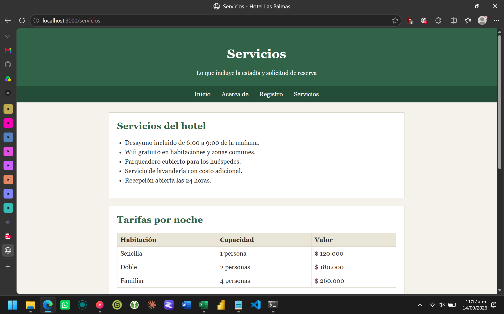
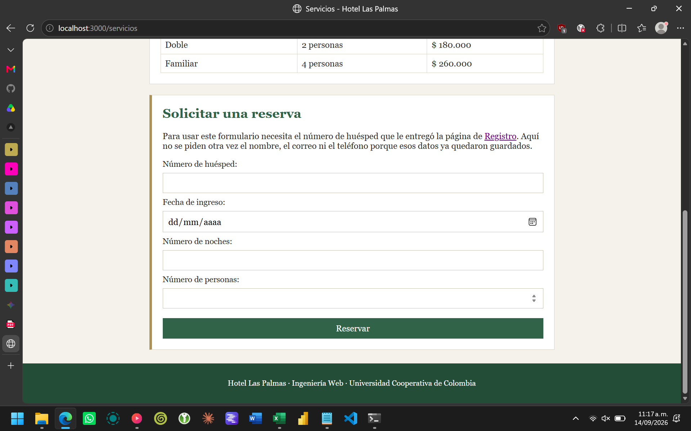
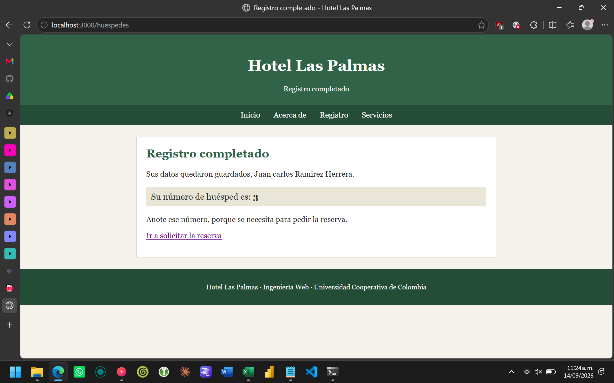
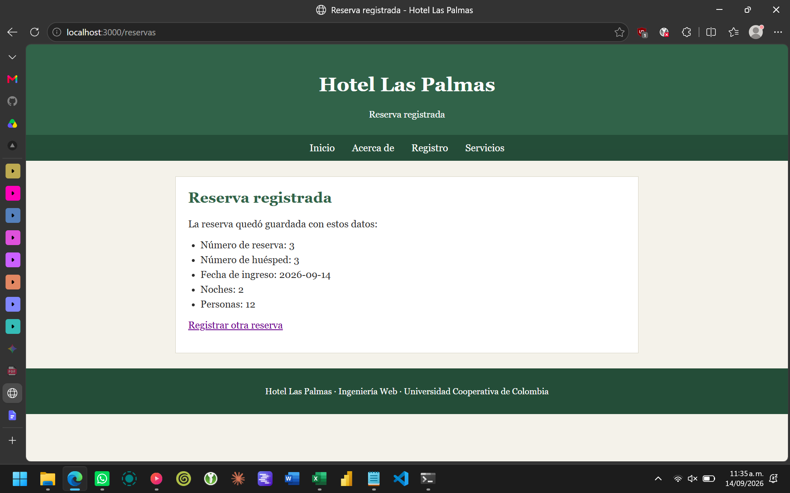
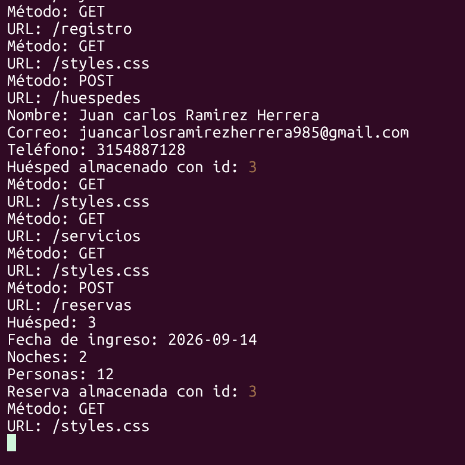
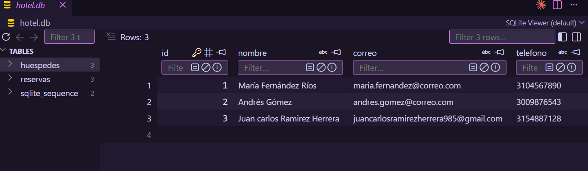
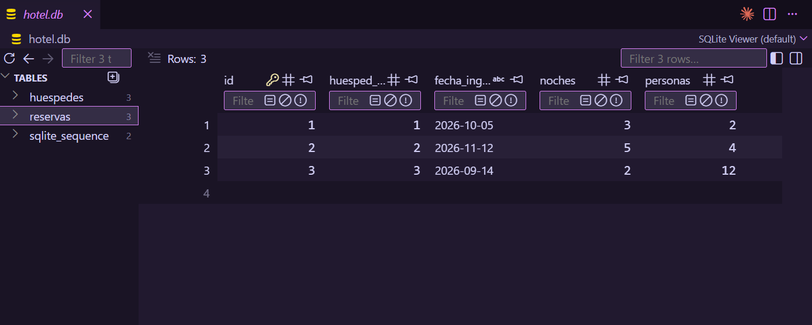

# Hotel Las Palmas

Práctica evaluativa del 20 % de la asignatura Ingeniería Web.

- **Autor:** Juan Ramírez Herrera
- **Asignatura:** Ingeniería Web
- **Programa:** Ingeniería de Software
- **Institución:** Universidad Cooperativa de Colombia
- **Temática asignada:** Hotel

## Descripción

Sitio web de un hotel con cuatro páginas y un servidor hecho únicamente con
módulos que ya vienen incluidos en Node.js. La información se guarda en una
base de datos SQLite llamada `hotel.db`.

El sitio tiene dos formularios:

- **Formulario de registro** (`registro.html`): pide nombre, correo y teléfono
  del huésped. Al enviarlo, el servidor guarda los datos en la tabla
  `huespedes` y muestra en pantalla el número de huésped que generó SQLite.
- **Formulario del servicio** (`servicios.html`): pide el número de huésped
  obtenido antes, la fecha de ingreso, el número de noches y el número de
  personas. El servidor guarda esos datos en la tabla `reservas`. No vuelve a
  pedir el nombre, el correo ni el teléfono porque ya están guardados.

## Tecnologías utilizadas

- HTML
- CSS
- JavaScript
- Node.js 24
- Protocolo HTTP (módulo `node:http`)
- SQL
- SQLite (módulo `node:sqlite`)

No se usa ningún framework de estilos ni paquetes de npm.

## Árbol de archivos

```text
practica-hotel/
├── index.html
├── acerca.html
├── registro.html
├── servicios.html
├── styles.css
├── server.js
├── hotel.db
└── README.md
```

| Archivo | Descripción |
|---|---|
| `index.html` | Página principal con la presentación del hotel. |
| `acerca.html` | Información del hotel, del proyecto y del autor. |
| `registro.html` | Formulario para registrar al huésped. |
| `servicios.html` | Servicios, tarifas y formulario de reserva. |
| `styles.css` | Hoja de estilos compartida por las cuatro páginas. |
| `server.js` | Servidor: rutas GET y POST, validación e inserciones. |
| `hotel.db` | Base de datos SQLite con las dos tablas. |

## Rutas

| Método | Ruta | Archivo o respuesta | Código esperado |
|---|---|---|---|
| `GET` | `/` | `index.html` | 200 |
| `GET` | `/acerca` | `acerca.html` | 200 |
| `GET` | `/registro` | `registro.html` | 200 |
| `GET` | `/servicios` | `servicios.html` | 200 |
| `GET` | `/styles.css` | `styles.css` (`text/css`) | 200 |
| `POST` | `/huespedes` | HTML con el ID generado | 201 / 400 / 500 |
| `POST` | `/reservas` | HTML de confirmación | 201 / 400 / 500 |
| cualquiera | ruta no definida | HTML de error | 404 |

## Modelo de datos

Base de datos: `hotel.db`

### Tabla `huespedes` (entidad principal)

| Columna | Tipo | Propósito |
|---|---|---|
| `id` | `INTEGER PRIMARY KEY AUTOINCREMENT` | Identificador que genera SQLite. |
| `nombre` | `TEXT NOT NULL` | Nombre completo del huésped. |
| `correo` | `TEXT NOT NULL` | Correo electrónico. |
| `telefono` | `TEXT NOT NULL` | Número de teléfono. |

### Tabla `reservas` (operaciones)

| Columna | Tipo | Propósito |
|---|---|---|
| `id` | `INTEGER PRIMARY KEY AUTOINCREMENT` | Identificador de la reserva. |
| `huesped_id` | `INTEGER NOT NULL` | Número del huésped que reservó. |
| `fecha_ingreso` | `TEXT NOT NULL` | Fecha de entrada al hotel. |
| `noches` | `INTEGER NOT NULL` | Cantidad de noches. |
| `personas` | `INTEGER NOT NULL` | Cantidad de personas. |

La columna `huesped_id` es la que conecta la reserva con el huésped que la
solicitó. Los datos personales no se repiten en esta tabla.

## Requisitos

- Node.js 24 o superior.
- Puerto 3000 libre.

No hace falta ejecutar `npm install`.

## Cómo ejecutarlo

```bash
git clone URL_DEL_REPOSITORIO
cd practica-hotel
node --version
node server.js
# Abrir en el navegador: http://localhost:3000
```

Si al iniciar aparece una advertencia diciendo que SQLite es una función
experimental, se puede ignorar: el proyecto funciona igual.

Si se borra el archivo `hotel.db`, el servidor lo vuelve a crear junto con las
dos tablas la próxima vez que se ejecuta, porque las tablas se crean con
`CREATE TABLE IF NOT EXISTS`.

## Orden de uso

1. Entrar a **Registro** y llenar nombre, correo y teléfono.
2. El servidor guarda el huésped y muestra el número que generó SQLite
   (por ejemplo: *Su número de huésped es: 1*).
3. Entrar a **Servicios** y escribir ese número junto con la fecha de ingreso,
   las noches y las personas.
4. El servidor guarda la reserva en la segunda tabla usando ese número.

```text
Registro del huésped -> ID generado -> reserva con ese ID -> tabla reservas
```

## Cómo se procesa cada POST

El cuerpo de la petición llega por partes, así que se acumula con el evento
`data` y se procesa cuando ocurre `end`:

```javascript
let cuerpo = '';

req.on('data', fragmento => {
    cuerpo += fragmento.toString();
});

req.on('end', () => {
    const datos = new URLSearchParams(cuerpo);

    const nombre = datos.get('nombre')?.trim();
    const correo = datos.get('correo')?.trim();
    const telefono = datos.get('telefono')?.trim();
});
```

Si algún campo queda vacío después del `trim()`, el servidor responde `400` y
no ejecuta el `INSERT`. En la reserva además se revisa que el número de
huésped, las noches y las personas sean números enteros mayores que cero, y
que el huésped exista en la primera tabla.

Las sentencias se preparan una sola vez al iniciar el servidor y se ejecutan
con parámetros `?`, sin concatenar lo que escribe el usuario dentro del SQL:

```javascript
const insertarHuesped = db.prepare(`
    INSERT INTO huespedes (nombre, correo, telefono)
    VALUES (?, ?, ?)
`);

const resultado = insertarHuesped.run(nombre, correo, telefono);

console.log('Huésped almacenado con id:', resultado.lastInsertRowid);
```

El valor de `lastInsertRowid` se muestra en la terminal y también en la página
de respuesta del navegador.

## Pruebas realizadas

| Prueba | Resultado obtenido |
|---|---|
| Navegación | Las cuatro rutas GET responden 200 y muestran su contenido. |
| CSS | La terminal registra `GET /styles.css` y llega con `text/css`. |
| Registro válido | Responde 201, crea el huésped y muestra su número. |
| Reserva válida | Con el ID anterior responde 201 y crea la reserva. |
| Coherencia | La tabla `reservas` guarda el `huesped_id` y no repite datos. |
| Campo vacío | Responde 400 y no se crea ningún registro. |
| Noches en 0 | Responde 400 por no ser un número válido. |
| Huésped inexistente | Al usar un ID que no existe responde 400. |
| Codificación | Tildes, `@` y espacios se guardan bien (ej: *María Fernández Ríos*). |
| Persistencia | Los datos siguen ahí después de reiniciar el servidor. |
| Ruta inexistente | `/noexiste` responde 404. |

Ejemplo de la salida en la terminal:

```text
Servidor disponible en http://localhost:3000
Método: POST
URL: /huespedes
Nombre: María Fernández Ríos
Correo: maria.fernandez@correo.com
Teléfono: 3104567890
Huésped almacenado con id: 1
Método: POST
URL: /reservas
Huésped: 1
Fecha de ingreso: 2026-10-05
Noches: 3
Personas: 2
Reserva almacenada con id: 1
```

Registros de prueba que trae `hotel.db`:

**huespedes**

| id | nombre | correo | telefono |
|---|---|---|---|
| 1 | María Fernández Ríos | maria.fernandez@correo.com | 3104567890 |
| 2 | Andrés Gómez | andres.gomez@correo.com | 3009876543 |
| 3 | Juan carlos Ramirez Herrera | juancarlosramirezherrera985@gmail.com | 3154887128 |

**reservas**

| id | huesped_id | fecha_ingreso | noches | personas |
|---|---|---|---|---|
| 1 | 1 | 2026-10-05 | 3 | 2 |
| 2 | 2 | 2026-11-12 | 5 | 4 |
| 3 | 3 | 2026-09-14 | 2 | 12 |

## Capturas

Las capturas siguen el orden pedido en la práctica: las cuatro páginas, el ID
generado, los dos mensajes de confirmación, la terminal y las dos tablas.

### 1. Las cuatro páginas

Página principal (`GET /`):



Página Acerca de (`GET /acerca`):



Página Registro (`GET /registro`), con el formulario de la primera tabla:



Página Servicios (`GET /servicios`), con los servicios y las tarifas:



Parte de abajo de la misma página, con el formulario de reserva. Solo pide el
número de huésped y los datos de la operación, no repite el nombre, el correo
ni el teléfono:



### 2. ID generado y primer mensaje de confirmación

Respuesta del `POST /huespedes`. El registro se guardó en la tabla
`huespedes` y la página muestra el identificador que generó SQLite con
`lastInsertRowid`, en este caso el número 3:



### 3. Segundo mensaje de confirmación

Respuesta del `POST /reservas`. La reserva quedó guardada en la segunda tabla
usando el número de huésped anterior:



### 4. Terminal

Salida del servidor durante ese recorrido. Se ven las peticiones `GET`,
la petición independiente a `/styles.css`, los datos recibidos en cada `POST`
y los dos identificadores generados:



### 5. Las dos tablas en SQLite

Tabla `huespedes`, con los tres registros y su identificador:



Tabla `reservas`. La columna `huesped_id` guarda el identificador de la
primera tabla y no repite los datos personales:


