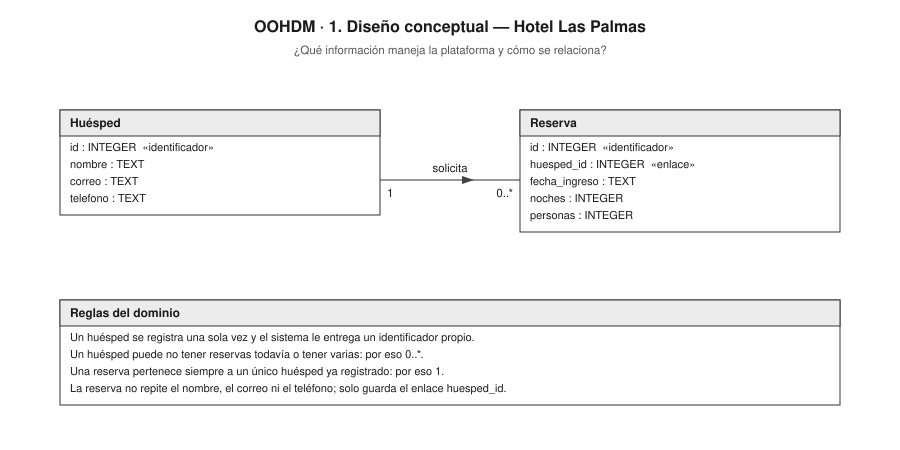
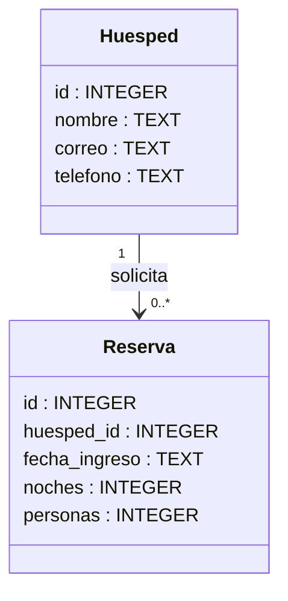
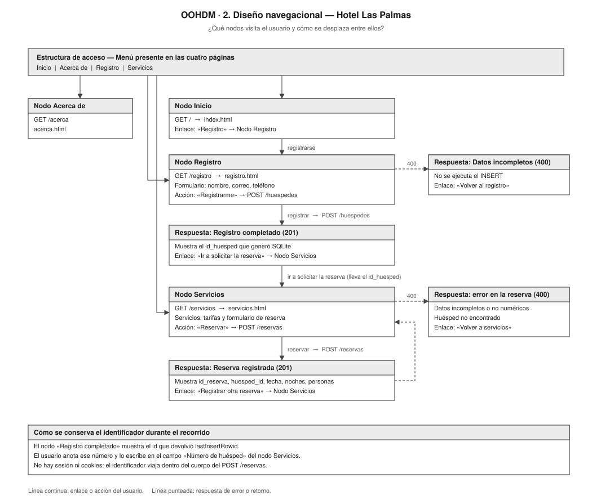
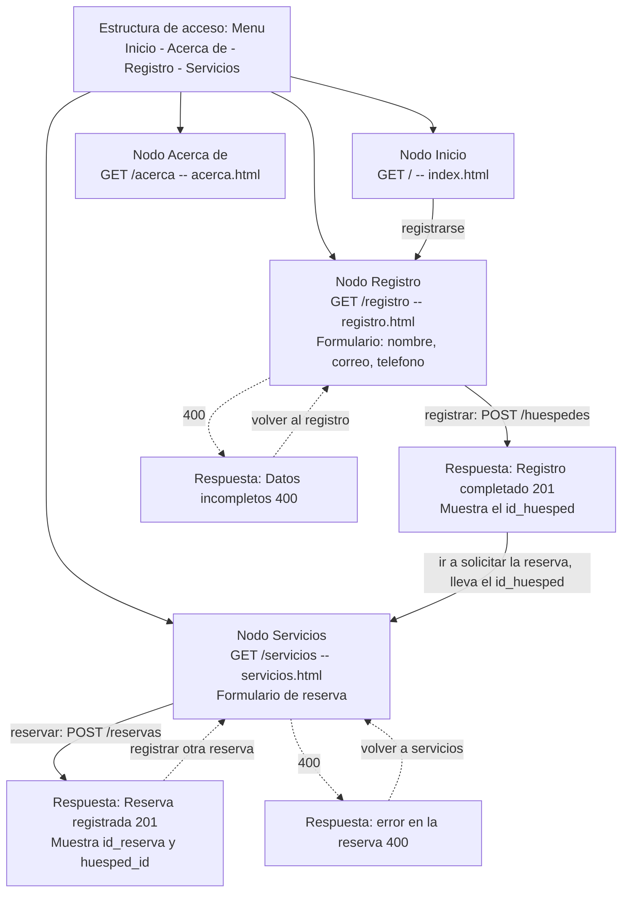
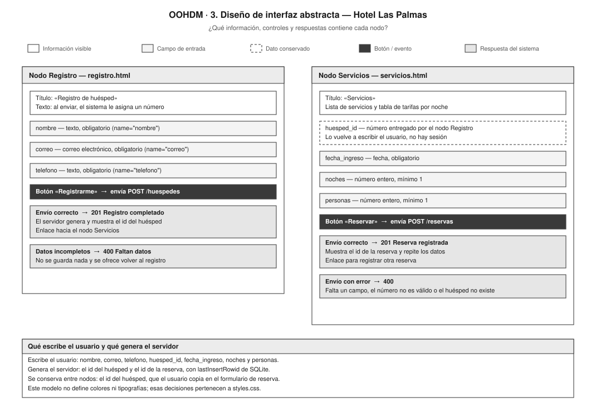
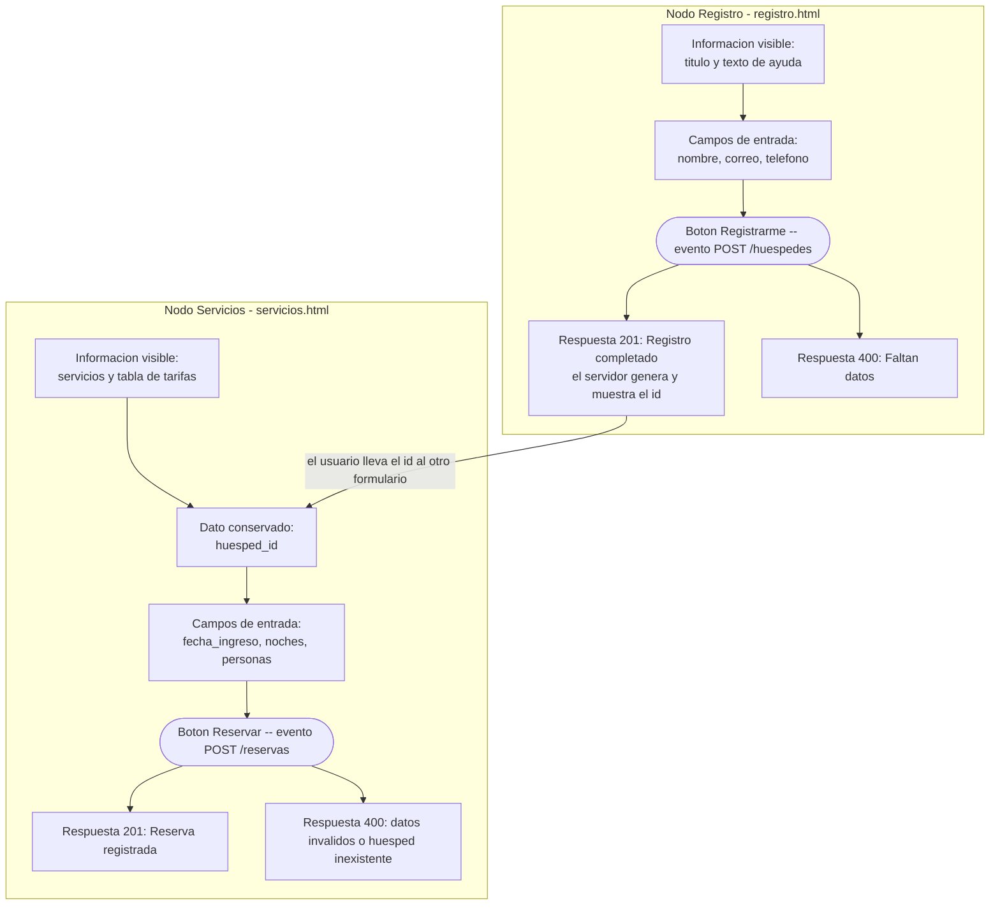
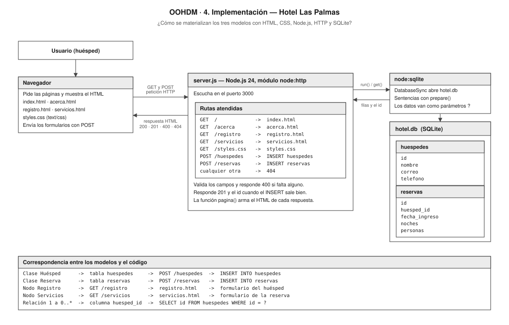
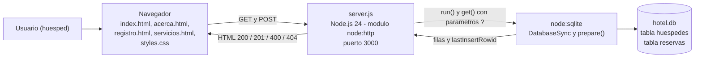

# Aplicación de OOHDM a la plataforma Hotel Las Palmas

Práctica evaluativa del 10 % de la asignatura Ingeniería Web.

| Dato | Valor |
|---|---|
| Autor | Juan Ramírez Herrera |
| Asignatura | Ingeniería Web |
| Programa | Ingeniería de Software |
| Plataforma asignada | Hotel |
| Entidad principal | Huésped (tabla `huespedes`) |
| Operación asociada | Reserva (tabla `reservas`) |

## Qué es OOHDM y cómo se aplicó aquí

OOHDM (*Object Oriented Hypermedia Design Method*) propone diseñar una
aplicación web por etapas, en lugar de empezar escribiendo código. Cada etapa
responde a una pregunta distinta:

| Modelo | Pregunta que responde | Archivo del diagrama |
|---|---|---|
| 1. Diseño conceptual | ¿Qué información maneja la plataforma y cómo se relaciona? | [`01_modelo_conceptual.svg`](01_modelo_conceptual.svg) |
| 2. Diseño navegacional | ¿Qué nodos visita el usuario y cómo se desplaza entre ellos? | [`02_modelo_navegacional.svg`](02_modelo_navegacional.svg) |
| 3. Interfaz abstracta | ¿Qué información, controles y respuestas tiene cada nodo? | [`03_interfaz_abstracta.svg`](03_interfaz_abstracta.svg) |
| 4. Implementación | ¿Cómo se materializa todo lo anterior con tecnologías concretas? | [`04_implementacion.svg`](04_implementacion.svg) |

Los cuatro diagramas se hicieron para **esta** plataforma: usan los mismos
nombres de rutas, formularios, tablas y campos que están escritos en
`server.js`, en los archivos `.html` y en `hotel.db`.

---

## 1. Diseño conceptual



### Qué representa

El dominio del hotel tiene dos clases: **Huésped** y **Reserva**.

- **Huésped** es la entidad principal. Guarda los datos de la persona que se
  registra: `id`, `nombre`, `correo` y `telefono`. El `id` no lo escribe el
  usuario, lo genera la base de datos.
- **Reserva** es la operación asociada. Guarda `id`, `huesped_id`,
  `fecha_ingreso`, `noches` y `personas`.

La relación se lee así: **un huésped solicita cero o muchas reservas**, y
**una reserva pertenece siempre a un solo huésped**. Por eso las
multiplicidades son `1` del lado del huésped y `0..*` del lado de la reserva.

### Reglas del dominio

Una persona se registra una sola vez como huésped y el sistema le entrega un
identificador propio que la distingue de las demás. A partir de ese momento
esa persona puede no pedir ninguna reserva todavía, o pedir varias a lo largo
del tiempo; por eso la multiplicidad del lado de la reserva es `0..*`. En
cambio, una reserva no tiene sentido por sí sola: siempre tiene que
pertenecer a un huésped que ya exista, y por eso del otro lado la
multiplicidad es `1`. Esa dependencia es la que obliga a que el registro del
huésped ocurra **antes** que la reserva. Además, la reserva no vuelve a
copiar el nombre, el correo ni el teléfono: solo guarda el atributo
`huesped_id`, que es el enlace hacia la otra clase. Así el dato personal vive
en un solo lugar y no se repite.

En este diagrama no aparecen páginas, rutas HTTP, HTML ni colores: eso
pertenece a los modelos siguientes.

<details>
<summary>Código Mermaid (fuente editable)</summary>



</details>

---

## 2. Diseño navegacional



### Nodos de la plataforma

Los nodos son las páginas y las respuestas que el usuario puede ver:

| Nodo | Cómo se llega | Qué muestra |
|---|---|---|
| Inicio | `GET /` | Presentación del hotel y enlace al registro. |
| Acerca de | `GET /acerca` | Información del hotel, del proyecto y del autor. |
| Registro | `GET /registro` | Formulario del huésped. |
| Servicios | `GET /servicios` | Servicios, tarifas y formulario de reserva. |
| Registro completado | Respuesta del `POST /huespedes` (201) | El número de huésped generado. |
| Reserva registrada | Respuesta del `POST /reservas` (201) | Los datos de la reserva guardada. |
| Datos incompletos / incorrectos | Respuestas `400` | El motivo del error y un enlace para volver. |

### Estructura de acceso

La estructura de acceso es el **menú** que aparece en las cuatro páginas y
también en todas las respuestas que arma la función `pagina()` de
`server.js`. Desde ese menú se puede llegar a cualquiera de los cuatro nodos
principales sin pasar por los demás.

### Enlaces y acciones

- Inicio → Registro: enlace **«Registro»**.
- Registro → Registro completado: acción **«Registrarme»** (`POST /huespedes`).
- Registro completado → Servicios: enlace **«Ir a solicitar la reserva»**.
- Servicios → Reserva registrada: acción **«Reservar»** (`POST /reservas`).
- Reserva registrada → Servicios: enlace **«Registrar otra reserva»**.
- Cualquier error `400` → enlace de retorno al formulario de origen.

### Cómo se conserva el identificador

Este es el punto más importante del recorrido. La plataforma **no usa sesión
ni cookies**. El nodo «Registro completado» muestra en pantalla el número que
devolvió SQLite (`lastInsertRowid`); el usuario anota ese número y lo vuelve a
escribir en el campo **«Número de huésped»** del nodo Servicios. De ahí viaja
dentro del cuerpo del `POST /reservas` y termina guardado en la columna
`huesped_id`. Antes de insertar, `server.js` comprueba con un `SELECT` que ese
huésped exista de verdad.

<details>
<summary>Código Mermaid (fuente editable)</summary>



</details>

---

## 3. Diseño de interfaz abstracta



### Qué representa

Este modelo describe **qué partes tiene cada formulario y qué hace cada una**,
sin decidir todavía colores ni tipografías. El diagrama distingue cinco tipos
de elemento:

| Tipo | Significado |
|---|---|
| Información visible | Texto que el usuario solo lee. |
| Campo de entrada | Dato que el usuario escribe. |
| Dato conservado | Dato que viene de un nodo anterior. |
| Botón / evento | Control que dispara el envío. |
| Respuesta del sistema | Lo que devuelve el servidor después del envío. |

### Nodo Registro (`registro.html`)

| Elemento | Tipo | Detalle |
|---|---|---|
| Título y texto de ayuda | Información visible | Explica que el sistema asignará un número. |
| `nombre` | Campo de entrada | `type="text"`, obligatorio. |
| `correo` | Campo de entrada | `type="email"`, obligatorio. |
| `telefono` | Campo de entrada | `type="text"`, obligatorio. |
| «Registrarme» | Botón / evento | Envía `POST /huespedes`. |
| Registro completado | Respuesta | `201` con el id generado y enlace a Servicios. |
| Faltan datos | Respuesta | `400`, no se guarda nada, enlace para volver. |

### Nodo Servicios (`servicios.html`)

| Elemento | Tipo | Detalle |
|---|---|---|
| Servicios y tarifas | Información visible | Lista y tabla de precios. |
| `huesped_id` | Dato conservado | Número entregado por el nodo Registro. |
| `fecha_ingreso` | Campo de entrada | `type="date"`, obligatorio. |
| `noches` | Campo de entrada | `type="number"`, mínimo 1. |
| `personas` | Campo de entrada | `type="number"`, mínimo 1. |
| «Reservar» | Botón / evento | Envía `POST /reservas`. |
| Reserva registrada | Respuesta | `201` con el id de la reserva y los datos. |
| Error de la reserva | Respuesta | `400` por campo vacío, número inválido o huésped inexistente. |

### Qué escribe el usuario y qué genera el servidor

- **Lo escribe el usuario:** `nombre`, `correo`, `telefono`, `huesped_id`,
  `fecha_ingreso`, `noches` y `personas`.
- **Lo genera el servidor:** el `id` del huésped y el `id` de la reserva, con
  `lastInsertRowid` de SQLite.
- **Se conserva entre nodos:** el `id` del huésped.

### Comportamiento ante un envío correcto y ante datos incompletos

- **Envío correcto:** el servidor responde `201`, ejecuta el `INSERT` y
  devuelve una página de confirmación con el identificador.
- **Datos incompletos:** el servidor responde `400`, **no** ejecuta el
  `INSERT` y devuelve una página que dice qué faltó y ofrece volver al
  formulario. En la reserva hay además dos validaciones extra: que los tres
  números sean enteros mayores que cero, y que el huésped exista.

Los colores y las tipografías no se evalúan en este modelo; esas decisiones
están en `styles.css`.

<details>
<summary>Código Mermaid (fuente editable)</summary>



</details>

---

## 4. Implementación



### Qué representa

El diagrama muestra las cuatro piezas reales y cómo se hablan entre ellas:

1. **Usuario (huésped)** → usa el navegador.
2. **Navegador** → pide las páginas, muestra el HTML con `styles.css` y envía
   los formularios con `method="POST"`.
3. **server.js** → servidor hecho con el módulo `node:http` de Node.js 24,
   escuchando en el puerto 3000. Revisa `req.method` y `req.url` para decidir
   qué responder.
4. **node:sqlite → hotel.db** → `DatabaseSync` abre el archivo y las
   sentencias preparadas con `prepare()` hacen las inserciones y la consulta.

### Intercambio GET y POST

| Petición del navegador | Respuesta del servidor |
|---|---|
| `GET /` | `200` + `index.html` |
| `GET /acerca` | `200` + `acerca.html` |
| `GET /registro` | `200` + `registro.html` |
| `GET /servicios` | `200` + `servicios.html` |
| `GET /styles.css` | `200` + `styles.css` con `Content-Type: text/css` |
| `POST /huespedes` | `201` con el id, o `400` si faltan datos, o `500` |
| `POST /reservas` | `201` con la reserva, o `400`, o `500` |
| cualquier otra ruta | `404` |

### Consultas e inserciones sobre las dos tablas

Las tres sentencias se preparan una sola vez, al arrancar el servidor, y usan
parámetros `?` en lugar de concatenar lo que escribe el usuario:

```javascript
const insertarHuesped = db.prepare(`
    INSERT INTO huespedes (nombre, correo, telefono)
    VALUES (?, ?, ?)
`);

const insertarReserva = db.prepare(`
    INSERT INTO reservas (huesped_id, fecha_ingreso, noches, personas)
    VALUES (?, ?, ?, ?)
`);

const buscarHuesped = db.prepare(`
    SELECT id FROM huespedes WHERE id = ?
`);
```

- `insertarHuesped.run(...)` escribe en la tabla `huespedes` y devuelve
  `lastInsertRowid`, que es el número que se le muestra al huésped.
- `buscarHuesped.get(idNumero)` comprueba en la tabla `huespedes` que el
  número escrito exista antes de guardar la reserva.
- `insertarReserva.run(...)` escribe en la tabla `reservas` usando ese número
  en la columna `huesped_id`.

<details>
<summary>Código Mermaid (fuente editable)</summary>



</details>

---

## 5. Matriz de correspondencia

Esta tabla permite rastrear cada decisión de OOHDM hasta el código que la
implementa.

| Elemento OOHDM | Ruta o archivo | Tabla o campo | Evidencia funcional |
|---|---|---|---|
| Entidad principal: clase **Huésped** | `POST /huespedes` en `server.js` | tabla `huespedes` | Registro almacenado y ID generado con `lastInsertRowid`. |
| Operación asociada: clase **Reserva** | `POST /reservas` en `server.js` | tabla `reservas` | Reserva asociada al huésped mediante `huesped_id`. |
| Relación `1` — `0..*` | `buscarHuesped` en `server.js` | `SELECT id FROM huespedes WHERE id = ?` | Un `huesped_id` inexistente responde `400` y no inserta. |
| Nodo **Inicio** | `GET /` → `index.html` | no aplica | Página presentada con código `200`. |
| Nodo **Acerca de** | `GET /acerca` → `acerca.html` | no aplica | Página presentada con código `200`. |
| Nodo **Registro** | `GET /registro` → `registro.html` | no aplica | Formulario del huésped presentado. |
| Nodo **Servicios** | `GET /servicios` → `servicios.html` | no aplica | Formulario de reserva presentado. |
| Estructura de acceso: **menú** | `<nav>` en los 4 `.html` y en `pagina()` de `server.js` | no aplica | El menú aparece en todas las páginas y respuestas. |
| Evento **«Registrarme»** | `POST /huespedes` | `INSERT INTO huespedes (?,?,?)` | Respuesta `201` con el número de huésped. |
| Evento **«Reservar»** | `POST /reservas` | `INSERT INTO reservas (?,?,?,?)` | Respuesta `201` con el número de reserva. |
| Campo de entrada `nombre` | `registro.html`, `name="nombre"` | `huespedes.nombre` | El nombre aparece guardado en la tabla. |
| Campo de entrada `correo` | `registro.html`, `name="correo"` | `huespedes.correo` | El correo aparece guardado en la tabla. |
| Campo de entrada `telefono` | `registro.html`, `name="telefono"` | `huespedes.telefono` | El teléfono aparece guardado en la tabla. |
| Dato conservado `huesped_id` | `servicios.html`, `name="huesped_id"` | `reservas.huesped_id` | La reserva queda enlazada sin repetir datos personales. |
| Campo de entrada `fecha_ingreso` | `servicios.html`, `name="fecha_ingreso"` | `reservas.fecha_ingreso` | La fecha aparece en la confirmación y en la tabla. |
| Campo de entrada `noches` | `servicios.html`, `name="noches"` | `reservas.noches` | Un valor menor que 1 responde `400`. |
| Campo de entrada `personas` | `servicios.html`, `name="personas"` | `reservas.personas` | Un valor menor que 1 responde `400`. |
| Respuesta a datos incompletos | `POST` correspondiente | no se ejecuta el `INSERT` | Código `400` y la tabla no cambia. |
| Presentación visual | `GET /styles.css` → `styles.css` | no aplica | Llega con `Content-Type: text/css`. |
| Nodo inexistente | cualquier ruta no definida | no aplica | Código `404` con el menú y enlace a inicio. |

---

## 6. Revisión de consistencia entre los diagramas y el código

Después de dibujar los cuatro modelos se revisó uno por uno contra el
repositorio. El resultado fue:

- Los nombres de los nodos del modelo navegacional coinciden con las rutas
  `GET` de `server.js` (`/`, `/acerca`, `/registro`, `/servicios`).
- Los nombres de los campos del modelo de interfaz abstracta coinciden con los
  atributos `name` de los dos formularios y con las columnas de `hotel.db`.
- Las dos clases del modelo conceptual coinciden con las dos tablas y con sus
  tipos (`TEXT` / `INTEGER`).
- Las respuestas dibujadas (`201`, `400`, `404`) coinciden con los
  `res.writeHead(...)` del servidor.

**No fue necesario modificar la plataforma:** el código, los formularios y la
base de datos ya correspondían con los diagramas, así que se conservó tal cual
la funcionalidad de la práctica anterior.

Sí quedaron anotadas dos observaciones sobre cómo está hecho el enlace entre
las dos tablas, para explicarlas en la sustentación:

1. La columna `reservas.huesped_id` **no** tiene una restricción
   `FOREIGN KEY` declarada en el `CREATE TABLE`. La relación `1` — `0..*` del
   modelo conceptual se garantiza desde `server.js`, que ejecuta
   `SELECT id FROM huespedes WHERE id = ?` y responde `400` si el huésped no
   existe. Se dejó así a propósito: agregar la restricción obligaría a volver
   a crear la tabla y la práctica pide conservar la base de datos y la
   funcionalidad de la entrega anterior.
2. El identificador del huésped se conserva **manualmente** (el usuario lo
   copia del nodo de confirmación al formulario de reserva), no con sesión ni
   con un campo `hidden`. Eso está dibujado tal cual en el modelo navegacional
   y en el de interfaz abstracta, con el elemento marcado como *dato
   conservado*.

---

## 7. Cómo comprobar la correspondencia ejecutando el proyecto

```bash
node server.js
# Abrir http://localhost:3000
```

1. Entrar a **Registro**, llenar los tres campos y enviar. La respuesta `201`
   muestra el número de huésped → corresponde a la clase **Huésped** y a la
   tabla `huespedes`.
2. Entrar a **Servicios**, escribir ese número junto con la fecha, las noches
   y las personas. La respuesta `201` muestra la reserva → corresponde a la
   clase **Reserva** y a la tabla `reservas`.
3. Escribir un número de huésped que no exista: la respuesta es `400`, lo que
   demuestra la multiplicidad `1` del modelo conceptual.
4. Entrar a `http://localhost:3000/noexiste`: la respuesta es `404`, el nodo
   de error del modelo navegacional.

---

## 8. Archivos de esta carpeta

```text
docs/oohdm/
├── OOHDM.md                        este documento
├── 01_modelo_conceptual.svg
├── 02_modelo_navegacional.svg
├── 03_interfaz_abstracta.svg
├── 04_implementacion.svg
└── fuentes_editables/
    ├── 01_modelo_conceptual.mmd
    ├── 02_modelo_navegacional.mmd
    ├── 03_interfaz_abstracta.mmd
    └── 04_implementacion.mmd
```

Los archivos `.mmd` son la fuente editable de cada diagrama, escrita en
Mermaid. Se pueden abrir y modificar en <https://mermaid.live> o en cualquier
editor de texto. El mismo código está copiado dentro de este documento, en los
bloques desplegables **«Código Mermaid (fuente editable)»**.
